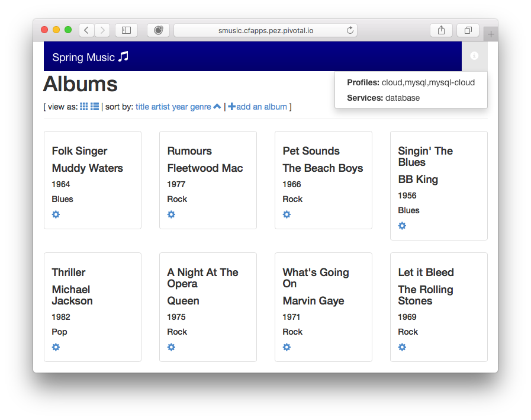
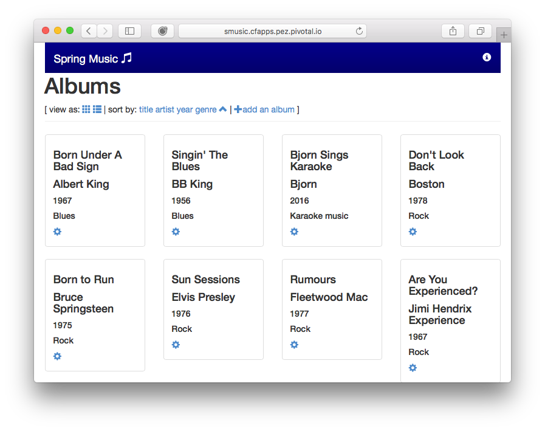
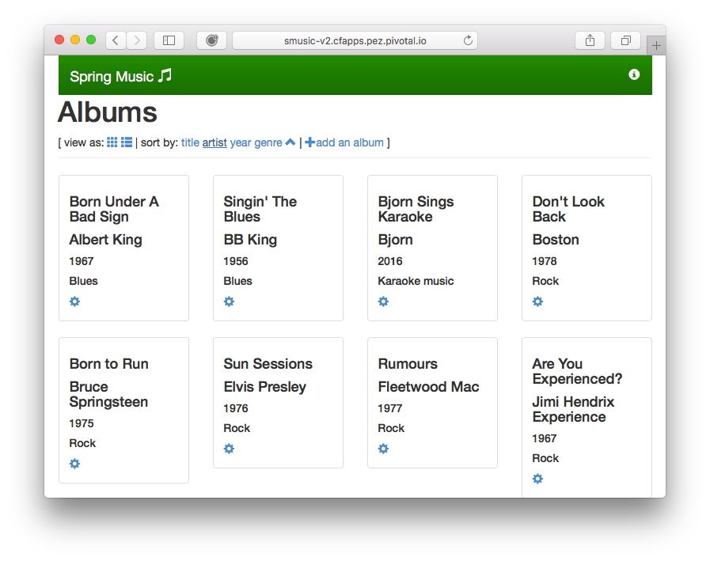
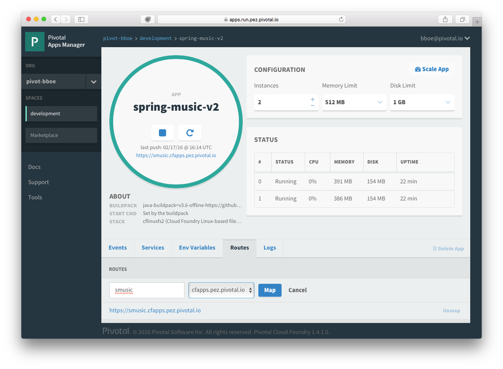
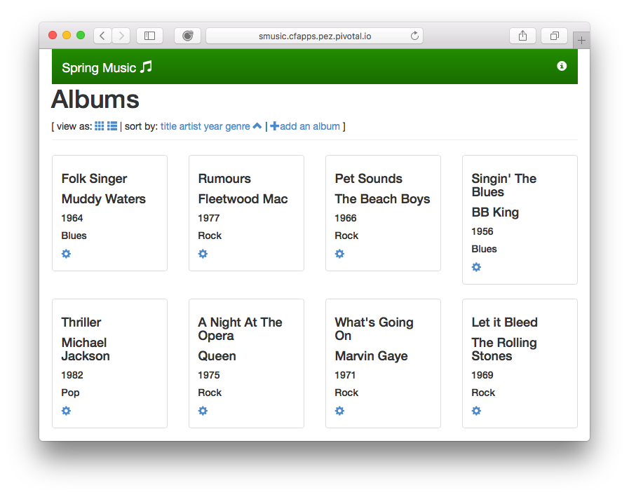

# PCF Blue/Green Demo
The purpose of this demo is to show how to do Blue/Green deployments on Pivotal Cloud Foundry.

Use the following steps to run the demo:

1. Create the database service that the demo application is depending on
 If using an installed version of Pivotal Cloud Foundry, use the following script, which requires the MySQL tile to already be installed:

 ```
 $ ./create-db-pcf.sh
 ```

 Use the following script if running the demo on Pivotal Web Services:

 ```
 $ ./create-db-pws.sh
 ```
2. Deploy version 1 of the Spring Music demo application to Cloud Foundry.

 ```
 $ cd spring-music-v1
 $ cf push
 ```
 This will push version one of the application to PCF and is configured to expose the production URL of the application to the end user. The URL is configured as smusic, but you may need to change this if this URL is already taken. To change the URL, edit manifest.yml in the spring-music-v1 directory and push the application again.
3. Verify that version 1 of the application is up and running

 ```
 $ cf apps
 Getting apps in org xxx / space development as yyy...
 OK
 
 name              requested state   instances   memory   disk   urls
 spring-music-v1   started           2/2         512M     1G     smusic...
 ```
3. Test the application using the URL provided.
 
 
 Note the blue banner on the application and press the info icon in the top-right corner to verify that the application is leveraging the database.
4. Add an album to provide your own test data.

 
5. Verify that the new album shows up in the v1 of the application

 
6. We've now a new high priority requirement to change the color of the banner from blue to green as soon as possible. We will therefore be upgrading Spring Music from v1 with the blue banner to v2 that has a green banner using Blue/Green deployment.
7. Go to the directory where Spring Music v2 is located

 ```
 $ cd ../spring-music-v2
 ```
8. Take a look at the manifest.yml file for Spring Music v2

 ```
 $ cat manifest.yml
 ---
 applications:
 - name: spring-music-v2
    memory: 512M
    instances: 2
    host: smusic-v2
    path: build/libs/spring-music.war
    services:
    - database
 ```
 Note that the application will be identified within Cloud Foundry as spring-music-v2 and will not overwrite version one of the application. Also note that it will be hosted on its own URL and thus not affect production traffic to version 1 and will leverage the same database instance as v1.
9. Push Spring Music v2 to Cloud Foundry

 ```
 $ cf push
 ```
10. Verify that the new version has been deployed

 ```
 $ cf apps
 Getting apps in org xxx / space development as yyy...
 OK
 
 name              requested state   instances   memory   disk   urls
 spring-music-v1   started           2/2         512M     1G     smusic...
 spring-music-v2   started           2/2         512M     1G     smusic-v2...
 ```
11. Test Spring Music v2 on its own private URL as indicated by the cf apps command (smusic-v2...)

 
 Verify that the color of the banner is green and that the test album we inserted in version one shows up. This verifies that the application works and that it's using the same database as version 1.
12. At this point the routing table within Cloud Foundry looks as follows

 | Route       | Appliation      | Instance  |
 | ----------- |-----------------|-----------|
 | smusic      | spring-music-v1 |         1 |
 | smusic      | spring-music-v1 |         2 |
 | smusic-v2   | spring-music-v2 |         1 |
 | smusic-v2   | spring-music-v2 |         2 |
13. It's time to start moving production load gradually to version 2. This is done by adding the production route to version 2.

 ```
 $ cf map-route spring-music-v2 cfapps.pez.pivotal.io -n smusic
 Creating route smusic... for org xxx / space development as yyy...
 OK
 Route smusic... already exists
 Adding route smusic... to app spring-music-v2 in org xxx / space development as yyy...
 OK
 ```
 This mapping can also be added using Apps Manager in the routes section of the application.

 
14. Verify that the smusic route is added to v2
 ```
 $ cf apps
 Getting apps in org xxx / space development as yyy...
 OK
 
 name              requested state   instances   memory   disk   urls
 spring-music-v1   started           2/2         512M     1G     smusic...
 spring-music-v2   started           2/2         512M     1G     smusic..., smusic-v2...
 ```
15. At this point the routing table within Cloud Foundry looks as follows

 | Route       | Appliation      | Instance  |
 | ----------- |-----------------|-----------|
 | smusic      | spring-music-v1 |         1 |
 | smusic      | spring-music-v1 |         2 |
 | smusic      | spring-music-v2 |         1 |
 | smusic      | spring-music-v2 |         2 |
 | smusic-v2   | spring-music-v2 |         1 |
 | smusic-v2   | spring-music-v2 |         2 |
 That means that half of the traffic to the production endpoint will be hitting Spring Music v1 and half of it to v2.
16. Go to the produciton end-point, refresh it a few times and make sure we start seeing the green banner as well.

 
17. Examine the logs of version 2 to make sure the application is running in a health state.

 ```
 $ cf logs spring-music-v2 --recent
 ```
18. Move more of the application traffic over to Spring Music v2 by scaling back v1.

 ```
 $ cf scale spring-music-v1 -i 1
 ```
 At this point 2/3rds of the traffic will be hitting Spring Music v2 as the PCF router distributes the load evenly across all instances available for a given route.
19. Move all load over to Spring Music v2 by stopping Spring Music v1

 ```
 $ cf stop spring-music-v1
 ```
 All load has now been transitioned to Spring Music v2.
20. The application can quickly be rolled back to version 1 by doing the following steps

 ```
 $ cf scale spring-music-v1 -i 2
 $ cf start spring-music-v1
 $ cf stop spring-music-v2
 ```
 In this case we're first configuring v1 back to have 2 instance, like we originally had. Then v1 is started back up again and v2 is shut down.
